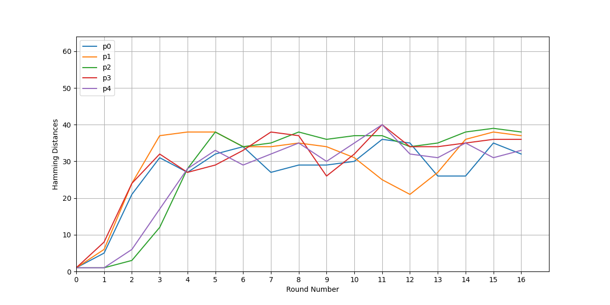
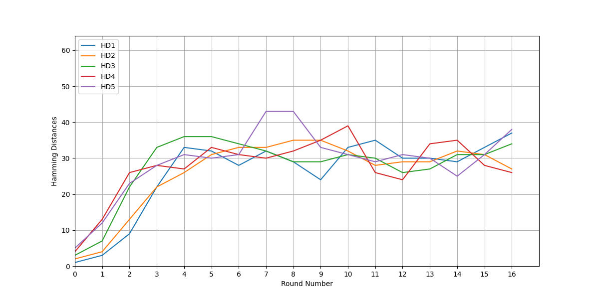
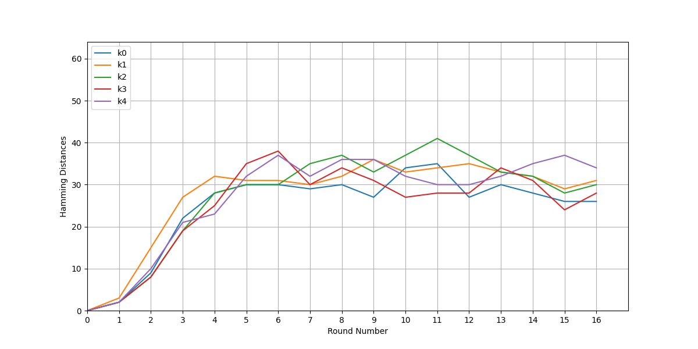

# Project Assignment 1

This is the project assignment 1 for the course in network security

## Task

The task for the project is to show avalanche effect in DES by using varying plainText and keys.

### Test 1

    Fixed Key with five pairs of PlainText having Hamming Distance= 1
    Key :- 2247BA5687FE09CE

    (1) Plaintexts:- AB3456FA7BF07D12 , AB3456FA79F07D12
    (2) Plaintexts:- 13BEF5C5C6EFF098 , 13BEF5CDC6EFF098
    (3) Plaintexts:- BD657AC12CFE89AC , BD657AC12CFE8DAC
    (4) Plaintexts:- 4092BFE671498ACD , 4892BFE671498ACD
    (5) Plaintexts:- BBD456CAFE90FE5C , BBD456DAFE90FE5C

### Test 2

    Fixed Key with five pairs of PlainText having different Hamming Distance
    Key :- AB50D0E4F2B89AC5

    (1) Plaintexts:- D0C045E34C87A91F , D0C04DE34C87A91F (HD=1)
    (2) Plaintexts:- ABDE40F0478912CC , AB5E40F04789128C (HD=2)
    (3) Plaintexts:- 9345BDEFACD87129 , F345BDEFECD87129 (HD=3)
    (4) Plaintexts:- FFD0AE432C78DE56 , F0D0AE432C78DE56 (HD=4)
    (5) Plaintexts:- EED456CA9087073A , EED4F6CA9787073A (HD=5)

### Test 3

    Fixed PlainText with five pairs of Keys having Hamming Distance =1
    PlainText:- BAD4560932872F1E

    (1) Keys:- BDEF00FA7BFDED12 , BCEF00FE7BFDED13
    (2) Keys:- B12EF5BDE412F098 , B12FFDBDE412F098
    (3) Keys:- FED38AC12CFDE87C , FED38AC12CF5E97C
    (4) Keys:- 98BDACE671498FED , 98BCACE471498FED
    (5) Keys:- A05FE3CAFE905DFB , A15FE3CAFE9055FB

Note :- The Plaintext and Keys are given in form of hexadecimal values

## Results

The result for each test are shown in the form of graphs as images down below :

### Test 1



### Test 2



### Test 3



## Inorder to run the tests on your machine

```bash
    pip install matplotlib
    python pa1.py
```
